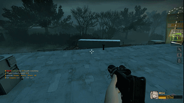

# **L4D2 Styx**


## **About:**

A rough versus-coop module

## **Important Notes**
* NOTHING IMPORTANT, I HANDLED IT.

## **Features(styx)**
* Configs based on the number of players, including single player.
* Improved bot Infected behaviors.
* Zed time for skillful kills.
* SI teleport(invisible, not a good way but works well.)
* ...

## **testing**
* Styx survival(styxsurvival): a survival mode, idea from Killing Floor.
* styxcoop (incomplete): for those maps not support versus mode.

## **Install**
#### **environment**
* apt install libc6:i386 lib32z1 libstdc++6 lib32stdc++6 libcurl4-openssl-dev  
* apt install make git

#### **full install**
```
 git clone --recursive https://github.com/Lind3ey/Left4Styx.git left4styx
 cd left4styx
 vim setup_env.sh ##set your left4dead2 folder to.
 cd custom 
 ## Make your custom setting. admin, group etc.
 cd ..
 source full_install.sh 
 ## Waiting the progress and Enter your cool host name.
 ## install complete.
```
#### **update**
```
 cd left4styx 
 git pull
 source full_install.sh
```
## **Files**
### **shell**
* setup_env.sh : script to config your left4dead2 dir and spcomp(compiler) dir.
* install_styx.sh : script to compile and install styx.
* install_full.sh : Install l4d2-competitive-rework and styx.
* coding/Makefile : makefile to compile all .sp.
### **smx/sp**
* l4d2_zedtime.smx : Zed time for skillful kills.
* styx_cmds_coop.smx : Versus coop cmds.
* styx_director_during_tank : as name.
* styx_dummys*.smx : Bot infected behaviors.
* ladder_boost.smx : as name.
* ssitp.smx : bot infected teleporter.
* single_core.smx : should be called styx core.
* playernum_mng.smx : config counts of survivors and infected.
* styxframe.smx : framework, intergrated match vote, server namer etc.
* coopcommands.smx : Cmds for campaign based mode.
* others : as name

 
 
 

 


# **Are you sure not joining a wrong server?**
** Github: [https://github.com/Lind3ey/Left4Styx](https://github.com/Lind3ey/Left4Styx)
## **Introduction**
* !styx/!matchstyx : show Styx config menu
#### **styx/styxcoop**
* !vs/!versus : config m vs n by !vs m n
* !ht/!hunter : as !vs but only hunters.
* !zed : toggle zed time
* !bot : warp survivor bots to you.