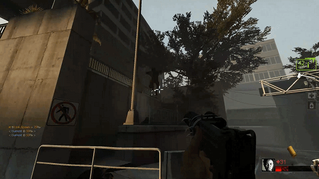

# **L4D2 Styx**

## **About:**

A rough versus-coop module

## **Important Notes**
* YOU NEED TO INSTALL [L4D2 Competitive Rework](https://github.com/SirPlease/L4D2-Competitive-Rework) FIRST.

## **Features(styx)**
* Configs based on the number of players, including single player.
* Improved bot Infected behaviors.
* Zed time for skillful kills.
* SI teleport(invisible, not a good way but works well.)
* ...

## **testing**
* Styx survival(styxsurvival): a survival mode, idea from Killing Floor.
* styxcoop (incomplete): for those maps not support versus mode.

## **Files**
### **shell**
* setup_env.sh : script to config your left4dead2 dir and spcomp(compiler) dir.
* install_styx.sh : script to compile and install styx.
* patch.sh : script to patch a update pack.
* full_install.sh : Install l4d2-competitive-rework and styx.
* getupdate.sh : script to get update from coding server.
* scripting/Makefile : makefile to compile all .sp.
### **smx/sp**
* coopcommands.smx : Cmds for campaign based mode.
* l4d2_zedtime.smx : Zed time for skillful kills.
* styx_cmds_coop.smx : Versus coop cmds.
* styx_director_during_tank : as name.
* styx_dummys*.smx : Bot infected behaviors.
* ladder_boost.smx : as name.
* ssitp.smx : bot infected teleporter.
* single_core.smx : should be called styx core.
* playernum_mng.smx : config counts of survivors and infected.
* styxframe.smx : framework, intergrated match vote, server namer etc.
* others : as name

 
 
 

 

